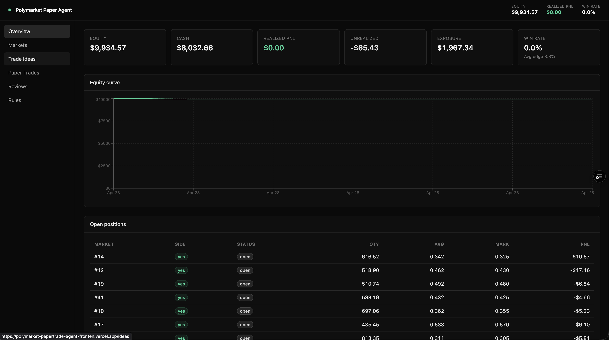
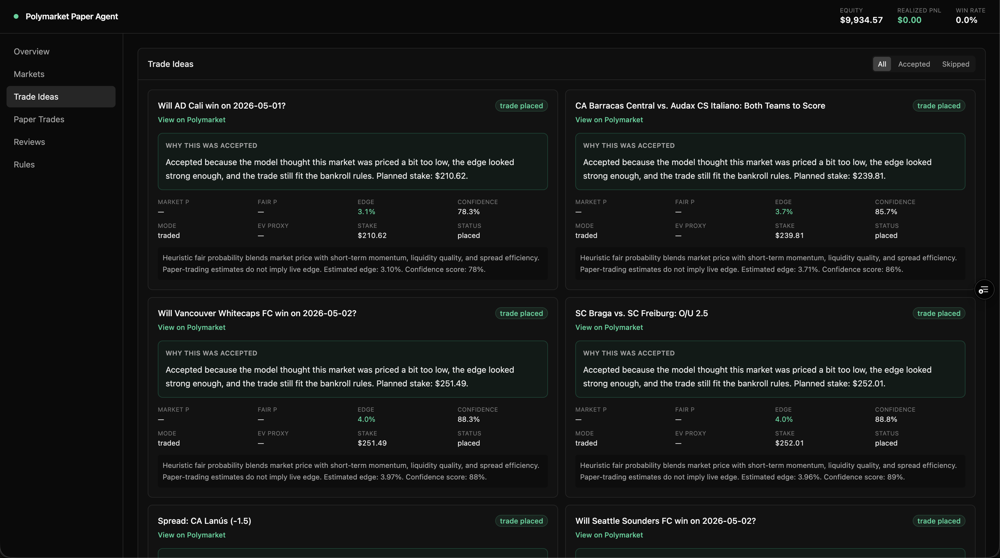
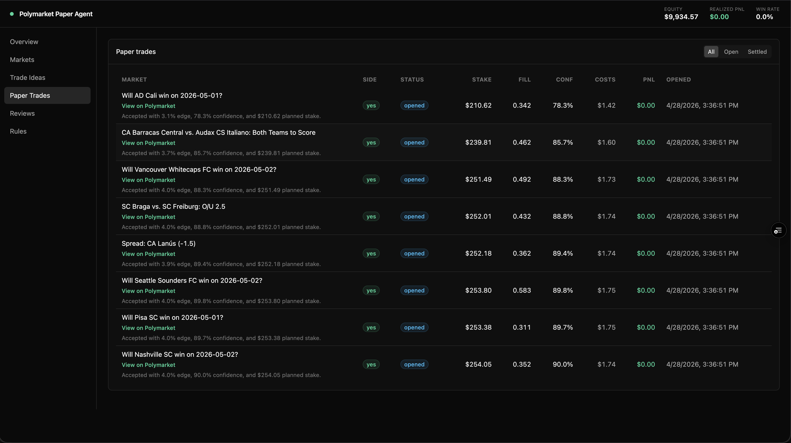
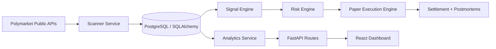

# Polymarket Paper Trading Agent

Paper-trading system for sports prediction markets. The app scans live Polymarket sports markets, estimates fair probability, enforces bankroll-aware risk controls, simulates paper trades with fees and slippage, and tracks portfolio performance in a dashboard.

No real-money trading is performed. No wallet signing or on-chain execution is included. Paper-trading results do not imply live profitability.

## What it does

- Scans live Polymarket sports markets within a configurable time window.
- Ranks opportunities using liquidity, volume, spread, and market-structure features.
- Generates heuristic and ML-ready trade signals.
- Applies hard bankroll and exposure limits before any paper trade is opened.
- Simulates fills, fees, slippage, settlement, and post-trade reviews.
- Shows portfolio, open positions, trade history, and postmortems in a React dashboard.

## Stack

- Backend: FastAPI, SQLAlchemy, PostgreSQL-ready persistence
- Data and modeling: pandas, numpy, scikit-learn, xgboost
- Frontend: React, TypeScript, Tailwind, Recharts
- Scheduling: APScheduler
- Testing: pytest
- Tooling: ruff, black, eslint, prettier
- Infra: Docker Compose

## Live app

- Main dashboard: [https://polymarket-papertrade-agent-frontend.vercel.app](https://polymarket-papertrade-agent-frontend.vercel.app)

## Screenshots

### Overview

[](https://polymarket-papertrade-agent-frontend.vercel.app)

### Trade ideas

[](https://polymarket-papertrade-agent-frontend.vercel.app/ideas)

### Paper trades

[](https://polymarket-papertrade-agent-frontend.vercel.app/trades)

## Architecture

See [docs/architecture.md](docs/architecture.md).
Deployment notes: [docs/deployment.md](docs/deployment.md).



## Monorepo layout

```text
backend/   FastAPI app, models, services, tests, seed scripts
frontend/  React + TypeScript + Tailwind dashboard
infra/     Docker Compose and local infrastructure config
docs/      Architecture notes and screenshot placeholders
```

## Backend structure

```text
app/
  api/
  core/
  db/
  models/
  repositories/
  schemas/
  services/
  utils/
```

Key services:

- `ScannerService`: fetches and filters live or sample markets, then stores `Market` and `MarketSnapshot`.
- `SignalService`: builds engineered features and emits heuristic or ML-backed `Signal` records.
- `RiskService`: approves or blocks trades and records `RiskDecision` reasons.
- `PaperExecutionService`: simulates fills and creates `Trade` and `Position` records.
- `SettlementService`: settles resolved trades and writes `Postmortem` records.
- `AnalyticsService`: computes dashboard metrics and portfolio snapshots.
- `EngineService`: orchestrates scan, signal, risk, execution, and settlement.

## Data model

The app persists:

- `Market`
- `MarketSnapshot`
- `Signal`
- `Trade`
- `Position`
- `PortfolioSnapshot`
- `Postmortem`
- `ModelRun`
- `RiskDecision`

## API

Core routes:

- `GET /markets/active`
- `GET /markets/candidates`
- `GET /signals`
- `GET /portfolio`
- `GET /trades`
- `GET /trades/{id}`
- `GET /postmortems`
- `GET /settings`
- `GET /health`

Engine routes:

- `POST /engine/run-scan`
- `POST /engine/run-signals`
- `POST /engine/run-paper-trades`
- `POST /engine/settle-paper-trades`
- `POST /engine/run-cycle`

## Local setup

### 1. Environment

```bash
cp .env.example .env
cp frontend/.env.example frontend/.env
```

For the quickest local setup, keep `DATABASE_URL=sqlite:///./backend/demo.db`.

### 2. Backend

```bash
cd backend
python3 -m venv .venv
source .venv/bin/activate
pip install -r requirements.txt
uvicorn app.main:app --reload
```

### 3. Frontend

```bash
cd frontend
npm install
npm run dev
```

App URLs:

- Frontend: `http://localhost:5173`
- Backend: `http://localhost:8000`

## Docker

```bash
docker compose -f infra/docker-compose.yml up --build
```

Docker Compose runs PostgreSQL, Redis, FastAPI, and the frontend.

## Deployment

Recommended production layout:

- Vercel for `frontend/`
- Railway for the FastAPI backend
- Managed Postgres for persistence
- Railway cron service for `backend/scripts/run_cycle_once.py`

Production safety defaults:

- `SCHEDULER_ENABLED=false`
- `AUTO_RUN_ON_STARTUP=false`
- `ENGINE_CONTROL_TOKEN` required when `APP_ENV=production`
- Frontend engine controls disabled by default with
  `VITE_ENABLE_ENGINE_CONTROLS=false` and `ENABLE_PUBLIC_ENGINE_CONTROLS=false`

See [docs/deployment.md](docs/deployment.md) for the full setup.

## Seed data and backfill

Sample data lives in `backend/app/data/demo_markets.json`.

To seed markets and run one paper-trading cycle:

```bash
cd backend
python scripts/backfill_sample_markets.py
```

## Testing

Backend coverage includes:

- implied probability conversion
- edge calculation
- risk checks
- position sizing
- fee and slippage impact
- settlement logic
- scan -> signal -> risk -> trade -> settlement flow

Run locally:

```bash
cd backend
pytest
```

Frontend checks:

```bash
cd frontend
npm run lint
npm run build
```

## CI

GitHub Actions runs:

- backend lint with `ruff`
- backend tests with `pytest`
- frontend lint
- frontend production build

Workflow file: [.github/workflows/ci.yml](.github/workflows/ci.yml)

## Engineering choices

- Structured JSON logging in the backend.
- Config-driven thresholds via `.env`.
- Clear separation between scanner, signal, risk, execution, settlement, and analytics services.
- Paper execution isolated behind a clean service boundary so a live adapter can be added later.
- Public market links for accepted trades resolve to actual Polymarket event pages.

## Limitations

- The ML mode is intentionally lightweight and improves only as settled paper-trading history grows.
- Public Polymarket fields may change over time.
- Fill quality, fees, and slippage are simplified approximations.
- This project is for research and experimentation, not for claiming alpha.

## Future real-execution roadmap

- Add a live execution adapter behind a dedicated trading interface.
- Add authenticated order placement and key management in a separate bounded module.
- Use order-book depth and historical market data for stronger fill simulation.
- Add Alembic migrations.
- Add Redis caching and task queues for heavier workloads.
- Add richer feature stores and optional sentiment adapters.
- Add offline evaluation, model versioning, and walk-forward validation.
