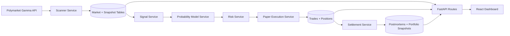

# Architecture

The MVP is intentionally paper-trading only. The execution boundary is isolated behind `PaperExecutionService`, which makes it straightforward to add a real execution adapter later without rewriting the scanner, signal engine, or risk layer.

